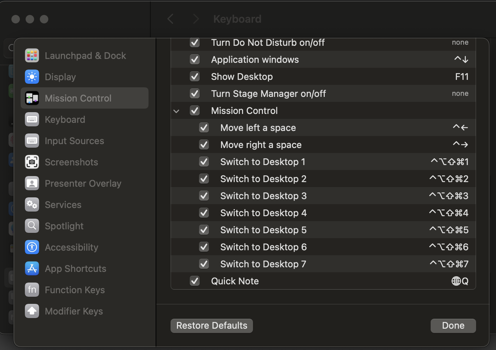

# Installation

Requirements:
- Nix Darwin installer [https://github.com/DeterminateSystems/nix-installer]
- MacOS Sonoma
- Same hostname as in the config

## Step 1
Clone the repository in a specific path you want via https

## Step 2
Initialise the setup with the following command:
```bash
nix run nix-darwin -- switch --flake /prefered/path/to/nix-dotfiles
```

Now your setup is running. It can take some minutes cause the cache and all necessary nix pkgs will initialized

## Step 3
Your setup should be setup now.
Further changes can be applied with
```bash
darwin-rebuild switch --flake /prefered/path/to/nix-dotfiles/
```

## Step 4
Install Homebrew. It's sometimes needed for specific packages. You don't have to take care about updates e.g. It will be automatically applied and managed by nix

- https://docs.brew.sh/Installation

## Further steps

### Keyboard
- If you want to switch your *keyboard layout* to a german standard layout 
    - Go to "Sytem Settings > Keyboard > Text Input". 
    - There you can change the layout by clicking on edit. 
    - Now another window is opening. Click on + in the left side to add another layout.
    - Select German and then German Standard. Save it.

### Yabai
Yabai is your window manager to get a feeling like i3

To make yabai fully usable you have to enter the following commands:

```bash
sudo nvram boot-args=-arm64e_preview_abi
```

Now you have to enter the recovery mode to disable the system inegrity protection.
- https://developer.apple.com/documentation/security/disabling_and_enabling_system_integrity_protection

Enable yabai scripting editons in your nix configuration

```bash
sudo yabai --load-sa
```

you also have to switch your mission control keyboard shortcuts like this 

You can find this option in System Settings > Keyboard > Click Keyboard Shortcuts > Mission Control

Now you can use the window switching feature by adding multi desktops you need seven. Six for switching to between you windows and one for the dockingstation mode.

### Shell
Change you shell to you nix defined shell by:

```bash
chsh -s <Change this to your shell path which you can find in /etc/shells there is a comment with shells managed by nix> 
```

After reload of your terminal the correct shell should be used.

### Sops (Optional)
If you want to use sops for your secrets you have to install it via package

To generate age keys you can use the following command:
```bash
mkdir -p ~/.config/sops/age
age-keygen -o ~/.config/sops/age/keys.txt
```
ATTENTION! The keys.txt file is your private key. Don't share it with anyone. Make sure that you exclude it from your backups and version control.

Now create a .sops.yaml file in your home directory with the following content and replace the age key with your public key:
```yaml
keys:
  - &tim age17w3rn544ay2yasdaw2gkpalxokr6dsfsd46u88u4gc4nnplsalunqdslqr2h4
creation_rules:
  - path_regex: secrets/[^/]+\.(yaml|json|env|ini)$
    key_groups:
    - age:
      - *tim
```

Now you can encrypt your secrets with the following command:
```bash
sops home/feature/secrets/secrets.yaml
```
This will open your editor and you can add your secrets. After saving and closing the editor the file will be encrypted.


#### Add another machine
If you want to add another machine to your encrypted secrets you have to add the public key of the new machine to the .sops.yaml file. 
```yaml
keys:
  - &tim age17w3rn544ay2yasdaw2gkpalxokr6dsfsd46u88u4gc4nnplsalunqdslqr2h4
  - &new_machine age17w3rn544ay2yasdaw2gkpalxokr6dsfsd46u88u4gc4nnplsalunqdslqr2h4
creation_rules:
    - path_regex: secrets/[^/]+\.(yaml|json|env|ini)$
        key_groups:
        - age:
        - *tim
        - *new_machine
```

You have to update the existing secrets with the new public key.
```bash
sops updatekeys home/feature/secrets/secrets.yaml
```

Now you can again encrypt your secrets with the following command:
```bash
sops home/fear/secrets/secrets.yaml
```

